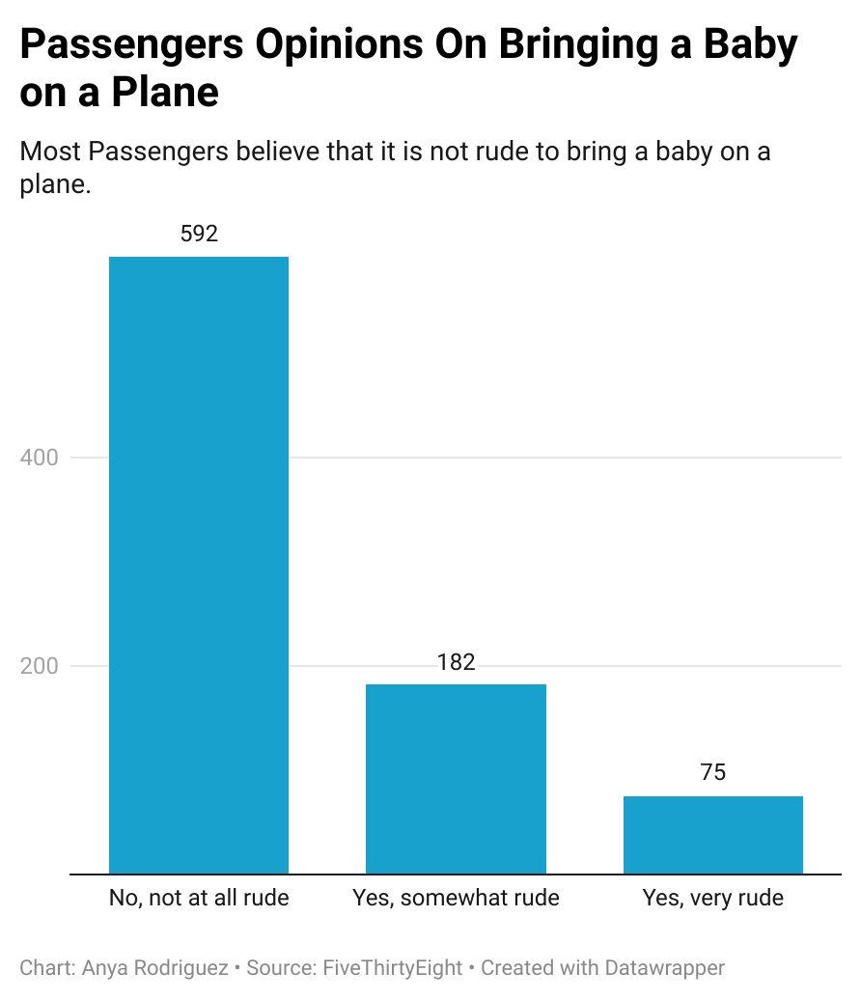

# Data for Passengers Opinions On Bringing a Baby on a Plane

I am a frequent flyer and I was wondering what most people had thought about babies being brought on planes. I knew that most people would not be annoyed, because it depends on the siutation, but a lot more people than I imgained found it **unacceptable under any circumstance**. That was interesting to see.

Majority of passengers are okay with babies being brought on a plane. We can see that with the chart I made.

